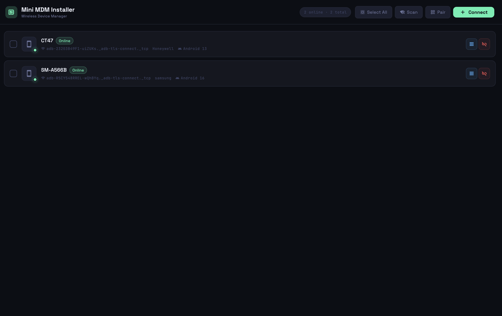
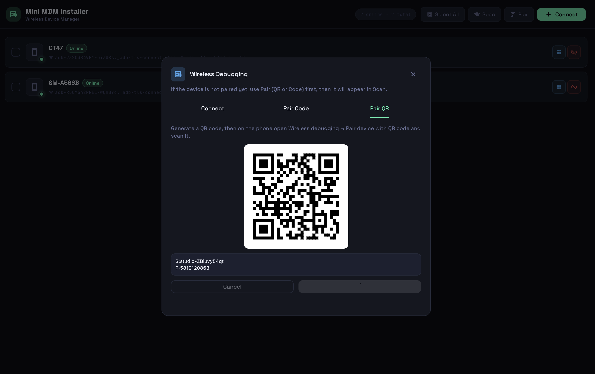
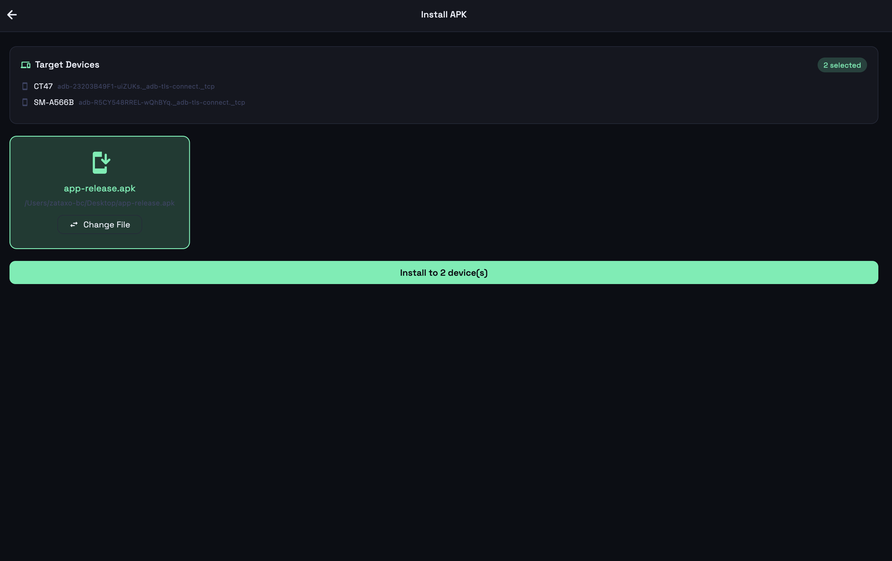
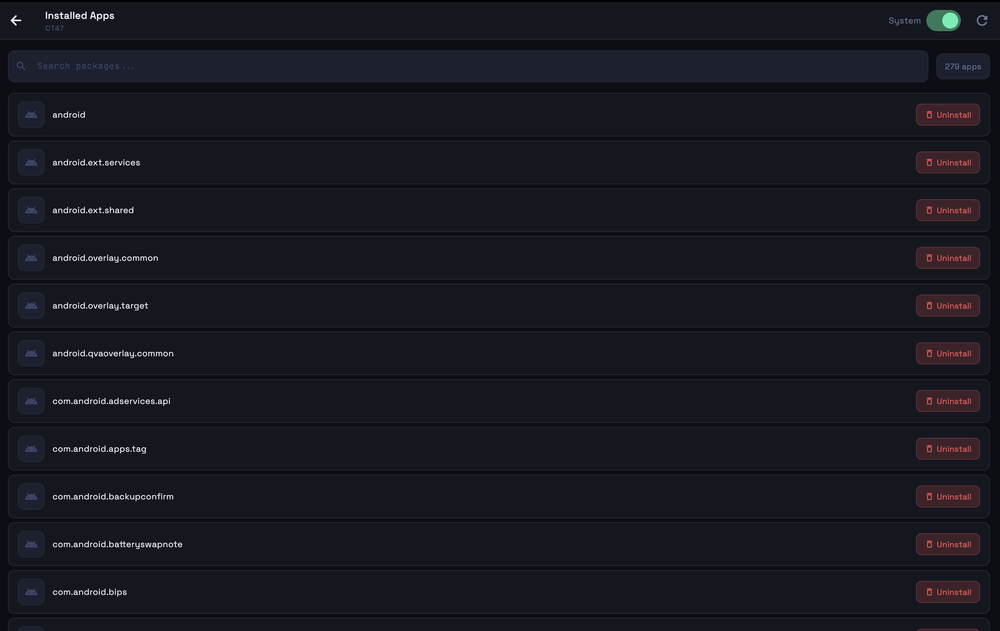

# Mini MDM Installer 🚀

A lightweight, cross-platform desktop application built with **Flutter** designed for mobile developers, QA engineers, and device lab administrators. This tool simplifies the process of discovering Android and iOS devices over your local wireless network (or USB) and allows you to deploy, manage, or wipe builds across **all connected devices concurrently** with a single click.

No more manual installation scripts or repetitive command-line loops for each separate testing device.

---

## 📸 Screenshots & Demo Interface

Below is a visual walk-through of the utility interface handling wireless network handshakes and parallel deployments:

### 1. Device Ecosystem Management
| 🖥️ 1. Active Wireless Discovery UI | 📱 2. Connected Device Profile |
| :---: | :---: |
|    *Real-time local network scanning and pairing status.* |    *Inspecting system versioning and connection logs.* |

### 2. Deployment Processing & Inventory
| 📦 3. Bulk Application Installer | 📱✨ 4. Installed Apps Manager |
| :---: | :---: |
|    *Streaming deployment progress to all nodes simultaneously.* |    *Viewing, sorting, and batch-managing apps currently on the devices.* |

---

## ✨ Features

*   **Wireless Device Discovery:** Automatically scan, pair, and list active Android and iOS devices on your local Wi-Fi network.
*   **Parallel Bulk Installation:** Select your mobile application binary (`.apk` or `.ipa`) and push it to every target device simultaneously.
*   **Simultaneous Uninstallation:** Instantly wipe pre-existing testing versions across all devices cleanly using the application package/bundle identifier.
*   **Local Cross-Platform Execution:** Built to run natively as a lightweight utility on your desktop machine (macOS/Windows).

---

## ⚠️ Current Scope & Limitations

Please keep the following constraints in mind for the current release of the application:

*   **🤖 Android Only (Stable):** The active release fully supports wireless and wired pairing, bulk installation, and app uninstallation via **Android APKs** using the system `adb` pipeline.
*   **🍏 iOS Support (Coming Soon):** The integration architecture for iOS (`.ipa` deployments via `xcrun devicectl` and `libimobiledevice`) is currently under active design and development. 
*   **🌐 Network Dependencies:** Wireless actions rely entirely on all devices being on the exact same local Wi-Fi subnet with a stable ping.

---

## 🤝 Contributing

We welcome contributors to help expand the capabilities of this tool! Whether you want to fix bugs, optimize the parallel deployment stream, or help build out the **iOS implementation**, your help is highly appreciated.

### How to Get Involved:
1. **Fork** the repository.
2. Create your feature branch (`git checkout -b feature/AmazingFeature`).
3. Commit your changes (`git commit -m 'feat: add some amazing feature'`).
4. Push to the branch (`git push origin feature/AmazingFeature`).
5. Open a **Pull Request**.

If you are an iOS developer with experience in `libimobiledevice` or Xcode CLI tools, feel free to check out our open issues regarding the iOS implementation path!

---

## 🛠️ System Architecture

The tool serves as a visual orchestration layer that directly communicates with native platform SDK toolchains:
[ Mini MDM Installer UI ]
                         │
          ┌──────────────┴──────────────┐
          ▼                             ▼
 [ Android Tooling ]             [ iOS Tooling ]
          │                             │
 (Android SDK `adb`)           (macOS: `xcrun devicectl`)
                               (Windows: `libimobiledevice`)

*   **Android:** Executes batch calls directly to the official Android SDK `adb` binary, streaming parallel data loops to handle connected devices.
*   **iOS (macOS Host):** Utilizes Xcode's native `xcrun devicectl` utility to handle secure device handshakes, network installations, and container updates.
*   **iOS (Windows Host):** Integrates open-source `libimobiledevice` protocols to communicate natively with iOS hardware without requiring an active Xcode environment.

---

## 📋 Prerequisites

To experience seamless wireless deployments, configure your environments as follows:

### Android Testing Pool
1. Enable **Developer Options** and **Wireless Debugging** on all target devices.
2. Ensure the host computer running this app has the Android SDK Platform-Tools (`adb`) installed and configured.
3. Both the host machine and mobile hardware must be on the exact same Wi-Fi subnet.

### iOS Testing Pool
1. Switch your target iOS devices to **Developer Mode** (Settings -> Privacy & Security -> Developer Mode).
2. All `.ipa` binaries **must** be properly code-signed with a development or provisioning profile that explicitly includes the UDIDs of your target hardware.
